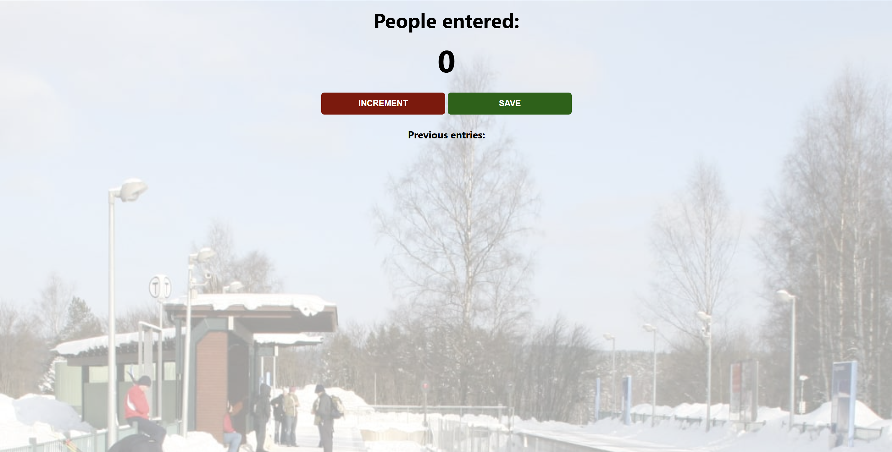

# People Counter

A lightweight project that tracks the number of people entering a location. Use the **Increment** button to increase the current count and **Save** to log the session while resetting the total.

## Getting started

Open `index.html` directly in your browser or serve the folder with any static web server.

## Project structure

- `index.html` – markup that wires the UI buttons to the counter logic.
- `index.js` – handles incrementing the tally and storing previous entries.
- `index.css` – styling for the station-themed interface.
- `screenshot.png` – interface preview used in the README.

## Preview

